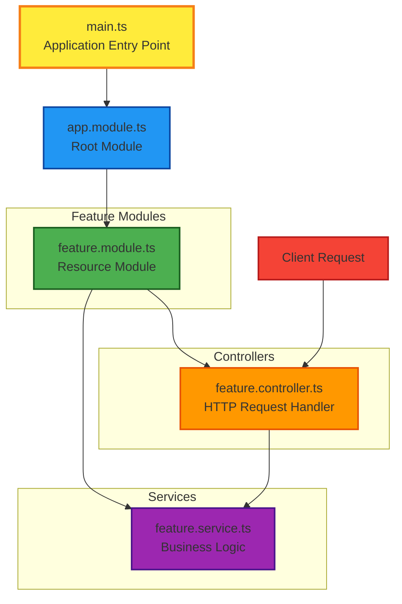

# NestJS

コア部分は、Expressで作られている。

トランスパイルの過程で、Expressを経由しているわけではない。

```
NestJS TypeScript → TypeScript Compiler → JavaScript
```

httpライブラリでExpressを利用している。

テストフレームワークは、jest。

## Nest CLI

Nest コマンドラインインターフェースを用いてコマンドでファイル生成が用意。

```zsh
// プロジェクト新規作成
$ nest new プロジェクト名
```

```zsh
// 新規でコントローラーの作成
$ nest g controller コントローラ名
```

```zsh
// MVCモジュールを一括作成するコマンド
$ nest g resource リソース名 --no-spec
```

## NestJsの基本要素

コア要素

- Controller
- Service
- Module

`main.ts`：アプリケーション（エントリーポイント）
`app.module.ts`：ルートモジュール
`feature.module.ts`：リソースモジュール
`feature.service.ts`：
`feature.controller.ts`：

開発した機能をアプリとして集約する
ルートモジュールに登録された機能だけが、アプリケーションで利用できる。



NestJSは、MVCモデルを採用している。

railsもMVCだが、`routes.rb`として、ルーティングファイルが存在している。

NestJSには、ルーティングファイルは存在しない、`Controller.ts`のデコレータでルーティングを実現している。
Spring bootも同じ。

## Module

`Controller`,`Service`などをまとめ、アプリケーションとして使えるようにする役割
NestJsでアプリケーションを実装するには、1つ以上のルートモジュール、0個以上のfeatureモジュールが必要

### Module定義

1. class定義の前に`@Module()`デコレータをつける。
2. `@Module()`プロパティを記述する

デコレータを付与することで、明示的にクラスに機能、役割を与えられる。

#### Contllorファイルに@Moduleクラスを書くとどうなってしまう？

> デコレータを付与することで、明示的にクラスに機能、役割を与えられる。
> ファイル名は、大体`~~~.contllor.ts`みたいに記述する。このファイルに、`@Module`のクラス名を書くと、実行時にエラーになる様子。

##### 記述時にエラーになった方が良くないか？

おそらく、こんな初歩なミスはほとんど発生しないと思うが、記述時にエラーは発生しない様子。
エラーを吐かせるには、専用のNestJSルール、Lintに追加ルールとして記述する。

### Moduleに定義できるプロパティ4つ

- `providers`:`@Injectable`デコレータがついたクラスを記述することでDIができるようになる
  `@Injectable`を記述するクラスの代表は、`Service`クラス
- `controllers`:`@Controller`デコレータがついたクラス
- `imports`:モジュール内部で必要な外部モジュールを記述（DBを利用したければ、importsにDBモジュールを記述する）
- `exports`:外部モジュールで利用したいものを記述

## NestJS CLI

下のコマンドで、ディレクトリレベルからモジュールを生成してくれる
`app.module.ts`への追加までやってくれる

```zsh
nest g module items
```

## Controller

クライアントからのリクエストを受けて、レスポンスを返す。
ルーティング機能を担ってる。

pathと`Controller`を紐づける（ハンドラー定義）

1. class定義の前に`@Controller()`デコレータを定義する
2. HTTPメソッドデコレータをつける

```zsh
nest g module items --no-spec
```

## Service

ビジネスロジックを定義

`Controller`から呼び出すことで、ユースケースを実現

ビジネスロジックを`Controller`に書いても、プログラムは動く。

保守、責務の明確、拡張性のために按分する

## DI（Dependency Injection）

依存関係のあるオブジェクトを外部から渡す。

`UsersController`は、`UsersService`がないと動かない。
つまり、`UsersController`は、`UsersService`に依存している状況。

`UsersController`が、`UsersService`を利用する方法

```typescript
@Controller('users')
export class UsersController {
    @Get()
    @findAll(){
        // これだと依存度が高い様子。
        // テストと、本番でサービス層を分けるときなどのこと
        const service = new UsersService();
        return servce.findAll();
    }
}
```

一般的には、外部でインスタンス化したものを`UsersController`に渡す様子

DIには、手動と自動がある様子。

### DIコンテナ

自動DIをDIコンテナと呼ぶ

`@Injectable`のついたServiceをModuleの`providers`に登録するだけで、nestjsが自動DIしてくれる。

ControllerのconstructorでServiceを引数にとる

nestjs CLIは、ほぼマストで利用した方が良さそう。
モジュール間の紐付けまで自動でやってくれるっぽいから。

### コンストラクタについて

```typescript
@Controller('items')
export class ItemsController {
  constructor(private readonly itemsService: ItemsService) {}
  @Get()
  findAll() {
    return this.itemsService.findAll();
  }
}
```

## modelを作る

ここで作るitemsモデルは、型定義を指す

## DTO(Data Transfer Object)

NestJSのバリデーション機能が使えるようになる

## NestJSでバリデーションを行う

ハンドラーがリクエストを受け取る前にリクエストに対して処理を行う
`Pipe`を使う

## `class validator`,`class transformer`でdtoにバリデーションを追加する

DTOにclass validatorを書いたときエラーが吐かれた。
`Unsafe call of a(n) error type typed value.`

再起動したら治った。

サーバー側からのエラーメッセージ何を返したら、フロント側や、後続開発者がわかるかを考える

## 例外処理(Exception:例外)

### BadRequestException

不正リクエスト

### UnauthoizedException

認証失敗

### NotFoundException

リクエストデータが存在しない

## ORM

prismaを使う

```bash
npx prisma init
```

このコマンドは、ルートで良いみたい

## PrismaとAPIを接続する

DIを用いてサービスとマイグレーションをコネクトする

利用する側のコンストラクタで利用したいサービスを引数として受け取る必要がある

## スキーマに書いたモデルをマイグレーションする

```bash
npx prisma migrate dev --name addUser
```

## 認証・認可

### 認証（Auth

通信相手が誰であるかを確認する

## psのハッシュ化

ハッシュ化されたパスワードをデコードすることは難しいらしい

```ts
const hashedPassword = await bcrypt.hash(password, 10);
```

## JWT

改ざん検知できる

3構成でできてる。
ドット結合されている。
要素別にbase64エンコードされている。

### ヘッダ

ハッシュアルゴリズム情報などメタデータ

### ペイロード

認証対象の情報（ユーザーデータ、任意情報等）

### 署名

ヘッダ、ペイロードをエンコードしたもの

### jwtメリット

有効期限をつけてセキュアなトークン発行ができる。
セッションと異なり、サーバーで状態管理しなくて良い。

パラメータを元に認証情報検証して、トークンを返却する。
クライアント側は、トークンをローカルストレージorクッキーに保存する。

`passport`ってライブラリを使う。

- `passport`:node.jsの認証ライブラリ。下のようなストラテジが用意されている。
  - ローカル認証
  - JWT認証
  - SNS認証

- `@nestjs/passport`:nestjsでpassportを統合するライブラリ

どうやって認証するかの方法をストラテジーというらしい。

ストラテジーは、基本的に分離されていることが多いらしい。

## 余談

jsライブラリをTypeScriptで利用する場合、@typesのインストールも必要。jsライブラリは型情報を持っていないため。

ランダムな値を生成できるコマンド
```zsh
openssl rand -hex 32
```
